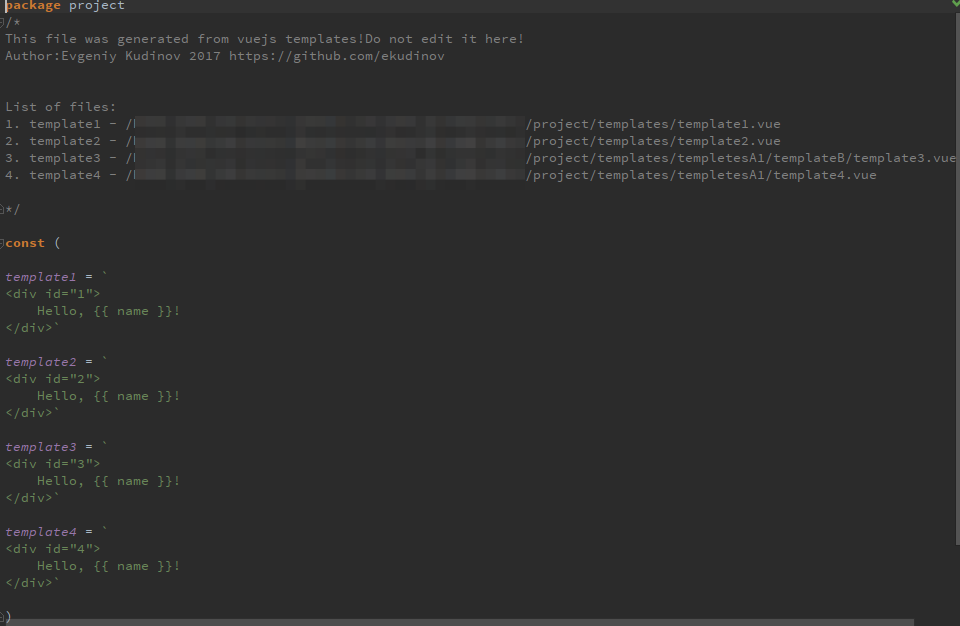

# gvtemplater
Tool for generation go file from vue templates.

  This program is designed to generate a go file from vue templates.
The reason for creating this program is to write vue templates with native ide support,
and then create from them go file in which the templates are represented as constants
and easily included in the program code developed under the library gopherjs-vue
https://github.com/oskca/gopherjs-vue.
  For example, a template named button.vue turns into a constant button = "" etc.
And then in the right place this constant can be used for its intended purpose.

Project structure for example before generation:

Vue template in IDE:

Generated go file:

Project structure after generation:

At this point, the program checks for duplicate template names, empty templates,
and if there are no templates with a .vue extension.

Help options:

